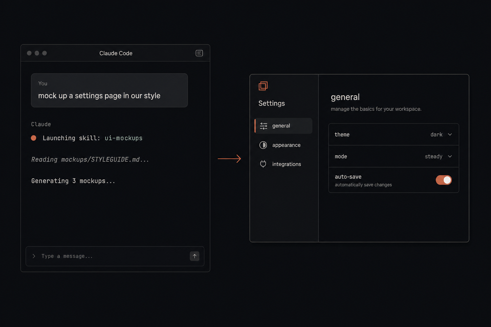

# ui-mockups



A Claude Code skill that generates AI image mockups of UI screens **in your repo's visual style**.

Two phases:

1. **Styleguide** — one-time per repo, authored by Claude. It reads your codebase (Tailwind config, CSS variables, component primitives, layout, voice) and writes `mockups/STYLEGUIDE.md`. Edit it once; it's reused on every run.
2. **Mockup generation** — cheap, repeatable. A Python script feeds the styleguide and your prompt into OpenAI `gpt-image-2` and saves N PNGs to `mockups/<slug>/`.

The styleguide is the source of truth — improving it improves every future mockup.

## When to use

- "Mock up a settings page in our style"
- "Give me 4 visual options for the empty state"
- "What could the new dashboard look like"
- Pre-code design exploration

It outputs **images**, not code. For code, use `frontend-design` or a Figma-to-code skill.

## Prerequisites

- macOS or Linux. Windows is untested — the `#!/usr/bin/env -S uv run …` shebangs and `chmod 0600` won't work natively.
- [`uv`](https://github.com/astral-sh/uv) — runs the Python scripts with inline dependencies, no `pip install` step.
- An [OpenAI API key](https://platform.openai.com/api-keys) **with billing enabled**. `gpt-image-2` is paid; check current pricing at https://platform.openai.com/docs/pricing.
- Optional, only if you want to anchor mockups on a screenshot of a live URL: `playwright install chromium`.

## Install

```bash
git clone https://github.com/<you>/ui-mockups ~/.claude/skills/ui-mockups
```

Then in your **own** terminal (not inside Claude Code, so the key never lands in the chat transcript):

```bash
python3 ~/.claude/skills/ui-mockups/scripts/set_token.py
```

You'll be prompted with hidden input. The key is saved to `~/.claude/skills/ui-mockups/.token` with mode `0600`.

To override the token path, set the `UI_MOCKUPS_TOKEN_FILE` environment variable to an absolute path before running either script.

## Use (inside Claude Code)

Just ask:

> mock up a settings page with profile, billing, and notifications tabs

Claude Code will load the skill automatically when the request matches its description.

## Use (standalone)

The mockup script is a normal CLI — Claude Code is not required:

```bash
uv run ~/.claude/skills/ui-mockups/scripts/generate_mockups.py \
  --prompt "settings page with profile, billing, notifications tabs" \
  --repo /path/to/your/repo \
  --styleguide /path/to/your/repo/mockups/STYLEGUIDE.md \
  --count 3
```

For the styleguide phase, see [`prompts/styleguide_instructions.md`](prompts/styleguide_instructions.md). Claude (or any agent with file-read tools) follows those instructions to write the file. There's no script for it because reading a codebase is what coding agents are good at.

A worked example of the artifact lives at [`examples/STYLEGUIDE.md`](examples/STYLEGUIDE.md) — the styleguide used to generate this README's cover image, alongside the [`examples/cover-prompt.md`](examples/cover-prompt.md) that produced it.

## Output

```
<repo>/mockups/
├── STYLEGUIDE.md            # phase-1 artifact, edited by you, reused
└── <slug>/
    ├── prompt.md            # full prompt sent to gpt-image-2
    ├── reference.png        # screenshot used as anchor (if any)
    ├── mockup-1.<ext>       # ext matches --output-format (png/jpg/webp)
    ├── mockup-2.<ext>
    └── mockup-3.<ext>
```

Add `mockups/*/*.png` to your `.gitignore` — commit the styleguide and prompts; don't commit images.

## CLI reference

| Flag | Default | Notes |
| --- | --- | --- |
| `--prompt` | required | what to mock up, plain language |
| `--styleguide` | required | path to `STYLEGUIDE.md` |
| `--repo` | cwd | output goes to `<repo>/mockups/<slug>/` |
| `--count` | 3 | clamped to `[1, 10]` |
| `--screenshot` | none | URL or PNG path used as a visual anchor |
| `--slug` | derived from `--prompt` | output subdirectory name |
| `--size` | `1536x1024` | `WxH` — edges multiples of 16, max edge 3840px, ratio ≤ 3:1, total pixels 655,360–8,294,400. Or `auto`. |
| `--quality` | `high` | `low`, `medium`, `high`, or `auto`. Lower is faster/cheaper. |
| `--background` | `auto` | `opaque` or `auto`. `gpt-image-2` does not support transparent backgrounds. |
| `--output-format` | `png` | `png`, `jpeg`, or `webp`. File extension follows. |
| `--output-compression` | none | 0–100 quality knob; only applies when format is `jpeg` or `webp`. |
| `--moderation` | `auto` | `auto` (standard filtering) or `low` (less restrictive). |

## Security notes

- The OpenAI API key is read **only** from `.token` (or `UI_MOCKUPS_TOKEN_FILE`) — never from `OPENAI_API_KEY` or any other env var. So it can't leak into `ps`, environ, or shell history.
- `set_token.py` refuses to run without a TTY, to prevent the key from being collected into a Claude Code chat transcript.
- The token file is created with `O_CREAT` mode `0600` — never world- or group-readable, even briefly.

## License

MIT — see [LICENSE](LICENSE).
